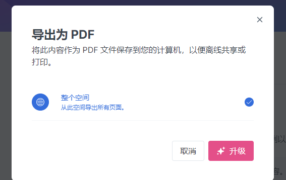

# 前言

### 前言

由于软件的阅读体验太差，所以我准备做一个精选库

本库会询问精选作者是否允许收录到本库

精选库会收录实验精选与黑洞精选，前期收录排名混乱，后期收录会按照目录规划

**若精选被撤则会删除收录，若移动则不会在本库里更改分区**

知识库暂不收录

web端目录下跳转到本库的文章，在文章下会提供原文链接和原文序号

求编辑/志愿者问一下精选是否同意收录，网址：`https://ziyilingran.gitbook.io/first/`

<mark style="color:red;">**文章的投稿格式请使用以下几种格式，否则不对乱码负责**</mark>


求收录文章可发邮件到ziyilingran@qq.com，文章请使用附件发送

邮件主题请在前面加【收录】 `例【收录】月球对地球的作用`

文章需要使用特殊效果，docx/doc不会兼容颜色字，[具体点我看这里的效果](https://app.gitbook.com/s/gi2XzLKVW0Gvv3YFZWIq/\~/changes/ksliRF3mYPm0aNkmxcPy/jing-xuan-jing-xiang/tou-gao-yan-shi/word-wen-jian-dao-ru-xiao-guo-ru-xia)

需要html效果请使用markdown

